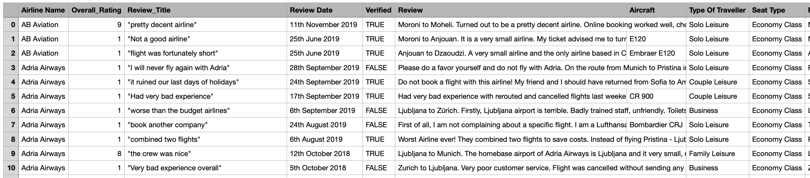
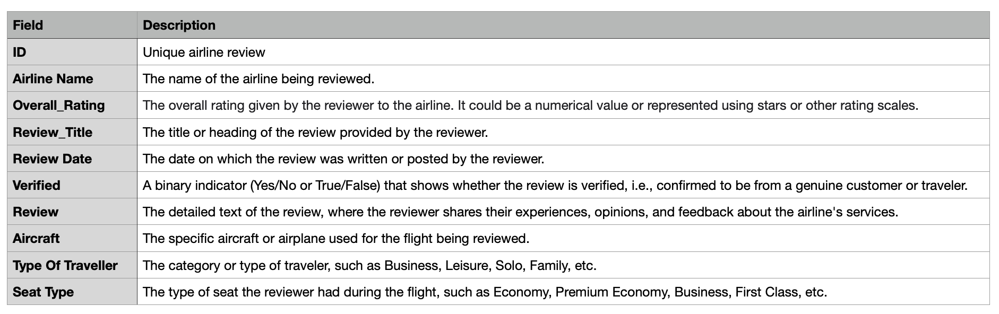

# Data 1202 Final Project - Data Archive

### This assignment compounds with Data extraction, Data transformation, and Data loading system.
<br/>

# 1. Data Selection - Find the datasets from kaggle.com for select the data to process.

### Step 1: Select the Airline Passenger Satisfaction dataset from kaggle.com for analyzing.

__URL :__ [Airline Passenger Satisfaction](https://www.kaggle.com/datasets/mysarahmadbhat/airline-passenger-satisfaction)

When extract the downloaded a zip file, there is a CSV file name "airline_passenger_satisfaction.csv". It has <b>24</b> variables and <b>129,880</b> observations.  


The zip file also give a data dictionary file as a CSV file named "data_dictionary.csv" to reference.


### Step 2: Select the Airline Review from kaggle.com to find the relationship between airline review and airline passenger satisfaction.

__URL :__ [Airline Review](https://www.kaggle.com/datasets/khushipitroda/airline-reviews)

When extract the downloaded a zip file, there is a CSV file name "Airline_Reviews.csv". It has __20__ variables and __23,170__ observations.  



This dataset has no data dictionary but it can found from the kaggle.com website it has show the data dictionary for Airline Reviews below.  



### Summary

Once the gathered datasets are ready. Now it should move to another process which is uploaded into database.

<br/>

# 2. Data Extraction - Upload dataset into database

### Step 1: Create a schema

Before upload the 

<br/>
<br/>

# 3. Data Transformation

<br/>
<br/>

# 4. Data Loading

<br/>
<br/>

# 5. Reflection

```sql
SELECT * FROM TABLE;
```

```py
print("hello world")
```

```py
print("something")
```

```sql
select * from TABLE;
```