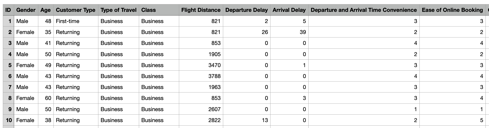
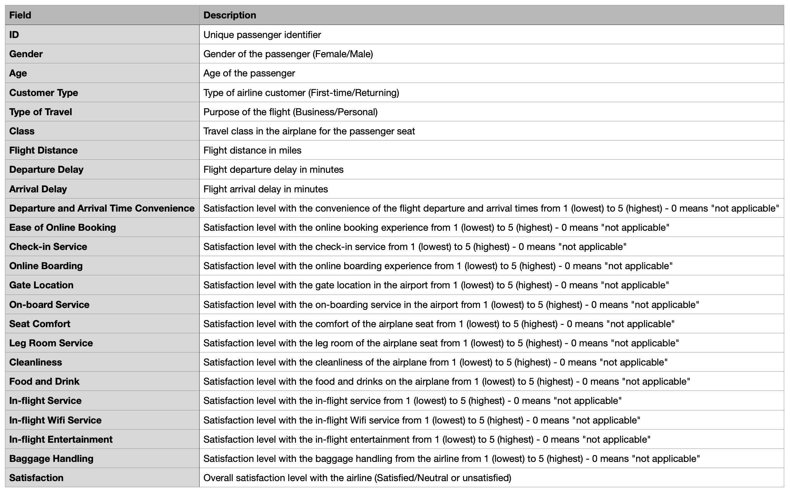

# Data 1202 Final Project - Data Archive

This assignment compounds with Data extraction, Data transformation, and Data loading system.
<br/>
<br/>

# 1. Data Selection

<p>Select the Airline Passenger Satisfaction dataset from kaggle.com for analyzing</p>

<h3>Reference URL</h3>
<a>https://www.kaggle.com/datasets/mysarahmadbhat/airline-passenger-satisfaction?select=airline_passenger_satisfaction.csv</a>

When extract the downloaded a zip file, there is a CSV file name "airline_passenger_satisfaction.csv". It has <b>24</b> variables and <b>129,880</b> observations.



The zip file also give a data dictionary file as a CEV file named "data_dictionary.csv" to reference.




<br/>
<br/>

# 2. Data Extraction

<br/>
<br/>

# 3. Data Transformation

<br/>
<br/>

# 4. Data Loading

<br/>
<br/>

# 5. Reflection

```sql
SELECT * FROM TABLE;
```

```py
print("hello world")
```

```py
print("something")
```

```sql
select * from TABLE;
```