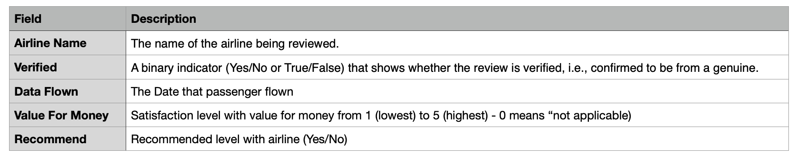
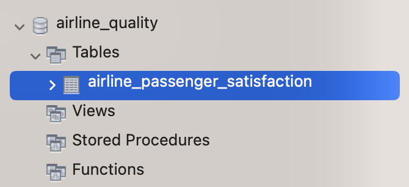
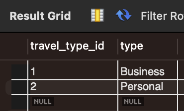
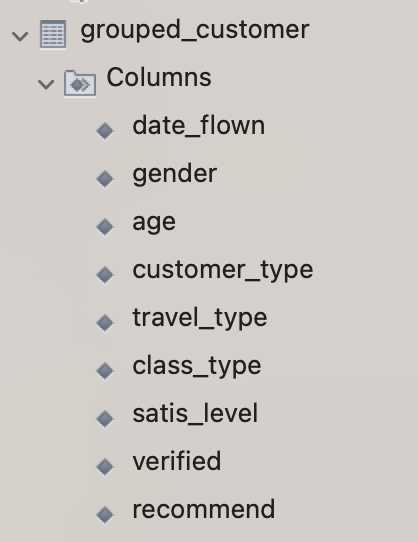
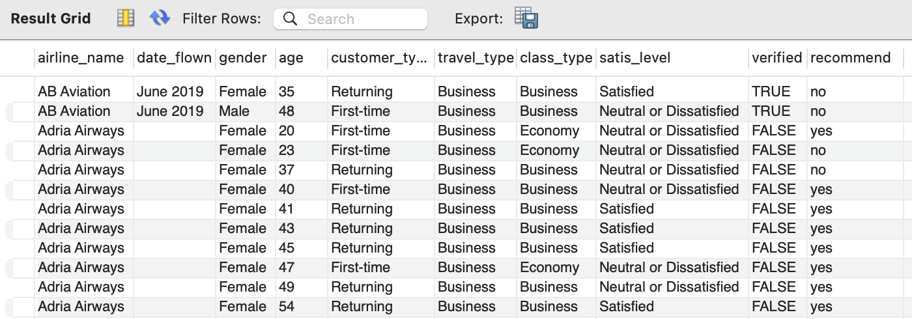
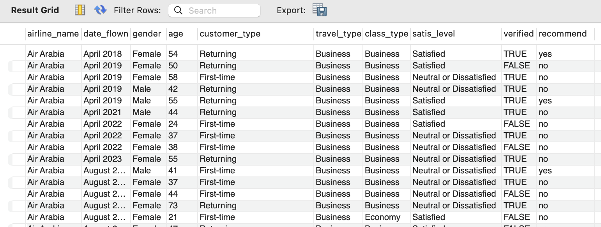
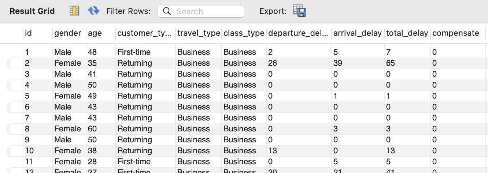
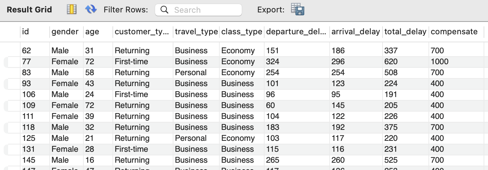

# Data 1202 Final Project - Data Archive

### This assignment compounds with Data extraction, Data transformation, and Data loading system.
<br/>

# 1. Data Selection - Find the datasets from kaggle.com for select the data to process.

### a. Select the Airline Passenger Satisfaction dataset from kaggle.com for analyzing.

__URL :__ [Airline Passenger Satisfaction](https://www.kaggle.com/datasets/mysarahmadbhat/airline-passenger-satisfaction)

When extract the downloaded a zip file, there is a CSV file name "airline_passenger_satisfaction.csv". It has <b>24</b> variables and <b>129,880</b> observations.  


The zip file also give a data dictionary file as a CSV file named "data_dictionary.csv" to reference.


### b. Create the dummy set named "airline_comments.csv" to find relationship between passenger satisfaction with airlines


The data diction for dummy file have been created for reference.



### Summary

Once the gathered datasets are ready. Now it should move to another process which is uploaded into database.

<br/>

# 2. Data Extraction - Upload dataset into database

### Step 1: Create a schema

Before upload the datasets, it requires to create a schema named "airline_quality" with SQL command below

```sql
CREATE SCHEMA `airline_quality`;
```

When execute the command above, the MySQL database creates a new schema as entered the command.


<br/>

### Step 2: Uploaded datasets into the created schema

Use the MySQL Workbench tool to upload the datasets with this step below

1. Right-Click on tab __tables__, select __Table Data Import Wizard__.


2. Select the dataset file path

#### Before Select file


Select the CSV file by click on __Browse...__ button

#### After Select file


Click __Next__ button

3. Review default generate table name, or change the table name


Click __Next__ button

4. Review auto generate data type from imported CSV file


Click __Next__ button

5. Review overall process 


Click __Next__ button

6. Importing the data


Click __Next__ button

7. Import result


Click __Finish__ button

8. View data result



<br/>

9. Select data from imported dataset into table with SQL command

```sql
SELECT * FROM airline_passenger_satisfaction;
```

#### Result


10. Perform import airline_comments.csv as well


### Step 3: Create dimension tables what are related to the Airline Passenger Satisfaction as the fact table as shown as diagrams below


#### 1. Create Customer type table

```sql
-- Create customer_type table
CREATE TABLE customer_type (
    customer_type_id int NOT NULL,
    type varchar(255),
    PRIMARY KEY (customer_type_id)
);

-- Insert value into customer_type table
INSERT INTO customer_type values (1, 'First-time');
INSERT INTO customer_type values (2, 'Returning');
```

#### Result of create and insert customer_type table


#### 2. Create class type table

```sql
-- Create class_type table
CREATE TABLE class_type (
    class_type_id int NOT NULL,
    type varchar(255),
    PRIMARY KEY (class_type_id)
);

-- Insert value into class_type table
INSERT INTO class_type values (1, 'Business');
INSERT INTO class_type values (2, 'Economy');
INSERT INTO class_type values (3, 'Economy Plus');
```

#### Result of create and insert customer_type table


#### 3. Create travel type table

```sql
-- Create travel_type table
CREATE TABLE travel_type (
    travel_type_id int NOT NULL,
    type varchar(255),
    PRIMARY KEY (travel_type_id)
);

-- Insert value into class_type table
INSERT INTO travel_type values (1, 'Business');
INSERT INTO travel_type values (2, 'Personal');
```

#### Result of create and insert travel_type table



#### 4. Create satisfaction level table

```sql
-- Create satis_level table
CREATE TABLE satis_level (
    satis_id int NOT NULL,
    level varchar(255),
    PRIMARY KEY (satis_id)
);

-- Insert value into class_type table
INSERT INTO satis_level values (1, 'Neutral or Dissatisfied');
INSERT INTO satis_level values (2, 'Satisfied');
```

#### 5. Result of create and insert satis_level table


#### Create delay type table

```sql
-- Create delay_type table
CREATE TABLE delay_type (
    delay_type_id int NOT NULL,
    level varchar(255),
    min_late int,
    max_late int,
    compensate int,
    PRIMARY KEY (delay_type_id)
);

-- Insert value into class_type table
INSERT INTO delay_type values (1, '1', 0, 180, 0);
INSERT INTO delay_type values (2, '2', 180, 300, 400);
INSERT INTO delay_type values (3, '3', 300, 540, 700);
INSERT INTO delay_type values (4, '4', 540, 720, 1000);
```
#### Result of create and insert delay_type table


### Summary

Once Airline Passenger Satisfaction dataset is uploaded into database and dimension tables are also created. The next step is transform the dataset into structure table what suitable to store the data.

<br/>

# 3. Data Transformation

### Step 1: Create a notebook file to perform transform the data

Create a jupyter notebook file to transform the data.


### Step 2: Perform load library for transform the data

#### Import pandas and sqlalchemy libraries
```py
# Import library
import pandas as pd
from sqlalchemy import create_engine
```

#### Setup value for create an engine
```py
# Declare engine variables
user = "root"
password = ""
port = 3306
database = "airline_quality"

# Create engine to query data from database
engine = create_engine('mysql+mysqldb://%s:%s@localhost:%i/%s'%(user, password, port, database))
```

#### Retrieve dataset from database
```py
# Retrieve airline passenger satisfaction from database
select_command = "SELECT * FROM airline_passenger_satisfaction"
df = pd.read_sql_query(select_command, engine)
df.head()

# Retrieve airline comments from database
select_command = "SELECT * FROM airline_comments"
passenger_comment = pd.read_sql_query(select_command, engine)
passenger_comment.tail()
```
#### Example of Retrieved from database for airline_passenger_satisfaction and airline_comments

a. airline_passenger_satisfaction table - Show all imported data


b. airline_comments table - Show all imported data


#### Select and join values what ID existing from airline_comments

```py
# Select values what have airline comments
selected_passenger_satis = passenger_satis[passenger_satis["ID"] <= 4336]

# Perform join 2 datasets
merge_df = pd.merge(
    selected_passenger_satis, passenger_comment, left_on="ID", right_on="ID", how="left"
).reset_index(drop=True)
```

#### Transform merged dataset
```py
# Convert customer Type value to dimension table
merge_df["customer_type"] = np.where(merge_df["Customer Type"] == "First-time", 1, 2)

# Convert Type of Travel to dimension table
merge_df["travel_type"] = np.where(merge_df["Type of Travel"] == "Business", 1, 2)

# Convert Class to dimension table
merge_df["class_type"] = np.where(
    merge_df["Class"] == "Business",
    1,
    np.where(merge_df["Class"] == "Economy", 2, 3),
)

# Convert customer satisfaction to dimension table
merge_df["satis_level"] = np.where(
    merge_df["Satisfaction"] == "Neutral or Dissatisfied", 1, 2
)

# Check null value for "Value for Money" variable
merge_df["Value For Money"].isnull().sum()

# Fill N/A value for "Value for Money" variable
merge_df["Value For Money"] = merge_df["Value For Money"].fillna(0)

# Change float datatype into integer data type
merge_df["Value For Money"] = merge_df["Value For Money"].astype(int)
```

#### Grouped data to export as the CSV file

Group and export grouped data by "Date Flown" variable
```py
# Grouped by "Date Flown" variable and selected only variable what impact to airline
grouped_customer = (
    merge_df.groupby(
        [
            "Airline Name",
            "Date Flown",
            "Gender",
            "Age",
            "customer_type",
            "travel_type",
            "class_type",
            "satis_level",
            "Verified",
            "Recommend",
        ]
    )
    .count()
    .reset_index()
)[
    [
        "Airline Name",
        "Date Flown",
        "Gender",
        "Age",
        "customer_type",
        "travel_type",
        "class_type",
        "satis_level",
        "Verified",
        "Recommend",
    ]
]

# Export grouped customer from selected criteria as the CSV file
grouped_customer.to_csv("../../file/grouped_customer.csv", index=True)
```

Select evaluate filled-in by passenger for analyze further more
```py
# Extract scores and other values from evaluate form for each customer
evaluate_score = merge_df[
    [
        "ID",
        "Departure Delay",
        "Arrival Delay",
        "Departure and Arrival Time Convenience",
        "Ease of Online Booking",
        "Check-in Service",
        "Online Boarding",
        "Gate Location",
        "On-board Service",
        "Seat Comfort",
        "Leg Room Service",
        "Cleanliness",
        "Food and Drink",
        "In-flight Service",
        "In-flight Wifi Service",
        "In-flight Entertainment",
        "Baggage Handling",
        "Value For Money",
    ]
]

# Calculate total delay
evaluate_score["total_delay"] = evaluate_score.loc[
    :, ["Departure Delay", "Arrival Delay"]
].sum(axis=1)

# Export evaluate score filled by passengers
evaluate_score.to_csv("../../file/evaluate_score.csv", index=True)
```

### Summary

From imported data and performed the data cleaning and transforming, the final of processes, they are 2 exported CSV files what can be uploaded into database for further analyze.

<br/>

# 4. Data Loading

### Step 1: Import the CSV file what grouped and extracted from Data Transformation

Perform uploaded the CSV file from transformed data


Result of imported data


### Step 2: Recheck database schema structure

1. Rename column for develop SQL easier


2. Execute these SQL commands to rename columns

```sql
-- Rename column "Date Flown" to date_flown
ALTER TABLE grouped_customer RENAME COLUMN `Airline Name` TO airline_name;

-- Rename column "Date Flown" to date_flown
ALTER TABLE grouped_customer RENAME COLUMN `Date Flown` to date_flown;

-- Rename column Gender to gender
ALTER TABLE grouped_customer RENAME COLUMN Gender TO gender;

-- Rename column Age to age
ALTER TABLE grouped_customer RENAME COLUMN Age TO age;

-- Rename column Verified to verified
ALTER TABLE grouped_customer RENAME COLUMN Verified TO verified;

-- Rename column Recommend to recommend
ALTER TABLE grouped_customer RENAME COLUMN Recommend to recommend;
```
3. Result after rename columns



### Step 3: Create view to retrieve values for analyze

1. Create view to view grouped passenger

```sql
-- Create or replace view for passenger satisfaction report
CREATE OR REPLACE VIEW View_Passenger_Satisfaction AS
SELECT
	a.airline_name as airline_name, 
	a.date_flown as date_flown,
    a.gender as gender,
    a.age as age,
    b.type as customer_type, 
    c.type as travel_type, 
    d.type as class_type, 
    e.level as satis_level, 
    a.verified as verified, 
    a.recommend as recommend
FROM grouped_customer AS a 
LEFT JOIN customer_type AS b
	ON a.customer_type = b.customer_type_id
LEFT JOIN travel_type AS c
	ON a.travel_type = c.travel_type_id
LEFT JOIN class_type AS d
	ON a.class_type = d.class_type_id
LEFT JOIN satis_level AS e
	ON a.satis_level = e.satis_id;
```

#### Retrieve all values from created view
```sql
SELECT * FROM View_Passenger_Satisfaction
```



#### Retrieve value with criteria
```sql
SELECT * FROM View_Passenger_Satisfaction
WHERE airline_name IN ("Air Arabia", "Bangkok Airway")
	AND date_flown <> "";
```



The values can be select as criteria below

| Value | Description |
| ---------- | -------------------- |
| airline_name | Enter the airline name as range |
| date_flown | Enter date when passenger had flown |
| age | Passenger age |
| gender | Enter gender <br> 1. Male <br> 2. Female|
| customer_type | Enter Customer type <br> 1. First-time <br> 2. Returning |
| travel_type | Enter travel type <br> 1. Business <br> 2. Personal |
| class_type | Enter class type <br> 1. Business <br> 2. Economy <br> 3. Economy Plus |
| satis_level | Enter passenger satisfaction level <br> 1. Neutral or Dissatisfied <br> 2. Satisfied |
| verified | Enter passenger verification status <br> 1. TRUE = Verified <br> 2. FALSE = Non-Verified|
| recommend | Enter passenger recommend airline status <br> 1. yes <br> 2. no |

2. Create view to retrieve compensate that airline have to pay to passenger incase of delay

```sql
 CREATE OR REPLACE VIEW View_Compensate AS
SELECT
	a.id,
    b.Gender as gender,
    b.Age as age,
    b.`Customer Type` as customer_type,
    b.`Type of Travel` as travel_type,
    b.Class as class_type,
	a.departure_delay as departure_delay, 
    a.arrival_delay as arrival_delay,
    a.total_delay as total_delay,
    CASE 
		WHEN total_delay >= 0 AND total_delay <= 180 THEN 0
        WHEN total_delay > 180 AND total_delay <= 300 THEN 400
		WHEN total_delay > 300 AND total_delay <= 540 THEN 700
        ELSE 1000
	END AS compensate
FROM evaluate_score AS a
LEFT JOIN airline_passenger_satisfaction AS b
	ON a.id = b.ID;
```

#### Retrieve all values from view
```sql
SELECT * FROM View_Compensate
```



#### Retrieve value with criteria
```sql
SELECT * FROM View_Compensate 
	where compensate > 0;
```


The values can be select as criteria below

| Value | Description |
| ---------- | -------------------- |
| age | Passenger age |
| gender | Enter gender <br> 1. Male <br> 2. Female|
| customer_type | Enter Customer type <br> 1. First-time <br> 2. Returning |
| travel_type | Enter travel type <br> 1. Business <br> 2. Personal |
| class_type | Enter class type <br> 1. Business <br> 2. Economy <br> 3. Economy Plus |
| departure_delay | Enter number or range of departure delay as minutes |
| arrival_delay | Enter number or range of arrival delay as minutes |
| total_delay | Enter number or range of total delay as minutes |
| compensate | Enter number of range of compensate in dollars that airline pays to passenger due to flight delay|

### Summary

After imported CSV files from transform data, They can created the views for analyze for gain more insight from them.   

<br/>

# 5. Reflection.

From the previous processes until created the views as final step. What I have learnt are listed below

1. The planning must be created as tasks and prioritize them before take any actions. Otherwise, it will be rework and spent much times in fixing the issues that occurred or redo the previous process.

2. Understand the data what is going to process, as data always requires data dictionary to understand the meaning of them before process any actions.

3. Understand the tools that is working with. Many tools has great features, it will reduce times in development much if I understand the key features that tool has.

4. Thinking systemically, this will reduce the errors and prevent what are missing or lacks and lead to reworks.