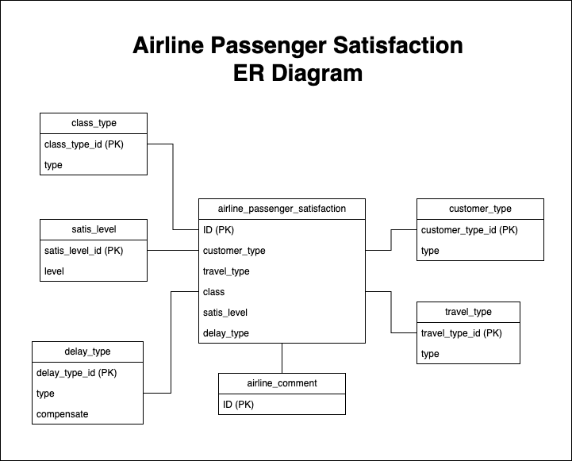

# Data 1202 Final Project - Data Archive

### This assignment compounds with Data extraction, Data transformation, and Data loading system.
<br/>

# 1. Data Selection - Find the datasets from kaggle.com for select the data to process.

### Select the Airline Passenger Satisfaction dataset from kaggle.com for analyzing.

__URL :__ [Airline Passenger Satisfaction](https://www.kaggle.com/datasets/mysarahmadbhat/airline-passenger-satisfaction)

When extract the downloaded a zip file, there is a CSV file name "airline_passenger_satisfaction.csv". It has <b>24</b> variables and <b>129,880</b> observations.  


The zip file also give a data dictionary file as a CSV file named "data_dictionary.csv" to reference.


### Summary

Once the gathered datasets are ready. Now it should move to another process which is uploaded into database.

<br/>

# 2. Data Extraction - Upload dataset into database

### Step 1: Create a schema

Before upload the datasets, it requires to create a schema named "airline_quality" with SQL command below

```sql
CREATE SCHEMA `airline_quality`;
```

When execute the command above, the MySQL database creates a new schema as entered the command.


<br/>

### Step 2: Uploaded datasets into the created schema

Use the MySQL Workbench tool to upload the datasets with this step below

1. Right-Click on tab __tables__, select __Table Data Import Wizard__.


2. Select the dataset file path

#### Before Select file


Select the CSV file by click on __Browse...__ button

#### After Select file


Click __Next__ button

3. Review default generate table name, or change the table name


Click __Next__ button

4. Review auto generate data type from imported CSV file


Click __Next__ button

5. Review overall process 


Click __Next__ button

6. Importing the data


Click __Next__ button

7. Import result


Click __Finish__ button

8. View data result


<br/>

9. Select data from imported dataset into table with SQL command

```sql
SELECT * FROM airline_passenger_satisfaction;
```

#### Result


### Step 3: Create dimension tables what are related to the Airline Passenger Satisfaction as the fact table as shown as diagrams below



#### 1. Create Customer type table

```sql
-- Create customer_type table
CREATE TABLE customer_type (
    customer_type_id int NOT NULL,
    type varchar(255),
    PRIMARY KEY (customer_type_id)
);

-- Insert value into customer_type table
INSERT INTO customer_type values (1, 'First-time');
INSERT INTO customer_type values (2, 'Returning');
```

#### Result of create and insert customer_type table


#### 2. Create class type table

```sql
-- Create class_type table
CREATE TABLE class_type (
    class_type_id int NOT NULL,
    type varchar(255),
    PRIMARY KEY (class_type_id)
);

-- Insert value into class_type table
INSERT INTO class_type values (1, 'Business');
INSERT INTO class_type values (2, 'Economy');
INSERT INTO class_type values (3, 'Economy Plus');
```

#### Result of create and insert customer_type table


#### 3. Create travel type table

```sql
-- Create travel_type table
CREATE TABLE travel_type (
    travel_type_id int NOT NULL,
    type varchar(255),
    PRIMARY KEY (travel_type_id)
);

-- Insert value into class_type table
INSERT INTO travel_type values (1, 'Business');
INSERT INTO travel_type values (2, 'Personal');
```

#### Result of create and insert travel_type table


#### 4. Create satisfaction level table

```sql
-- Create satis_level table
CREATE TABLE satis_level (
    satis_id int NOT NULL,
    level varchar(255),
    PRIMARY KEY (satis_id)
);

-- Insert value into class_type table
INSERT INTO satis_level values (1, 'Neutral or Dissatisfied');
INSERT INTO satis_level values (2, 'Satisfied');
```

#### 5. Result of create and insert satis_level table


#### Create delay type table

```sql
-- Create delay_type table
CREATE TABLE delay_type (
    delay_type_id int NOT NULL,
    level varchar(255),
    min_late int,
    max_late int,
    compensate int,
    PRIMARY KEY (delay_type_id)
);

-- Insert value into class_type table
INSERT INTO delay_type values (1, '1', 0, 180, 0);
INSERT INTO delay_type values (2, '2', 180, 300, 400);
INSERT INTO delay_type values (3, '3', 300, 540, 700);
INSERT INTO delay_type values (4, '4', 540, 720, 1000);
```
#### Result of create and insert delay_type table


### Summary

Once Airline Passenger Satisfaction dataset is uploaded into database and dimension tables are also created. The next step is transform the dataset into structure table what suitable to store the data.

<br/>

# 3. Data Transformation

### Step 1: Create a notebook file to perform transform the data

Create a jupyter notebook file to transform the data.


### Step 2: Perform load library for transform the data

#### Import pandas and sqlalchemy libraries
```py
# Import library
import pandas as pd
from sqlalchemy import create_engine
```

#### Query dataset from database
```py
# Declare engine variables
user = "root"
password = ""
port = 3306
database = "airline_quality"

# Create engine to query data from database
engine = create_engine('mysql+mysqldb://%s:%s@localhost:%i/%s'%(user, password, port, database))

# Retrieve airline passenger satisfaction from database
select_command = "SELECT * FROM airline_passenger_satisfaction"
df = pd.read_sql_query(select_command, engine)
df.head()
```
#### Retrieve result


<br/>

# 4. Data Loading

<br/>
<br/>

# 5. Reflection

```sql
SELECT * FROM TABLE;
```

```py
print("hello world")
```

```py
print("something")
```

```sql
select * from TABLE;
```